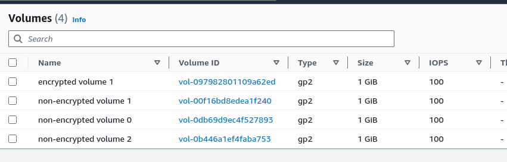
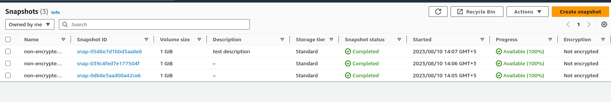
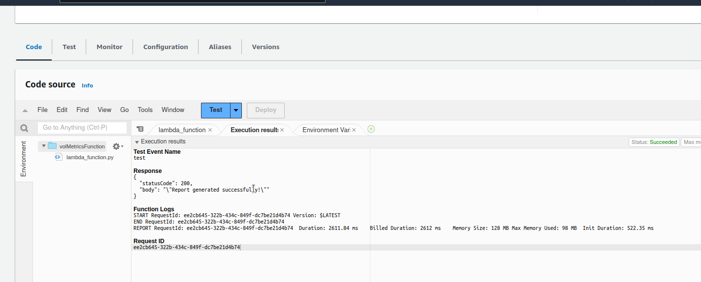
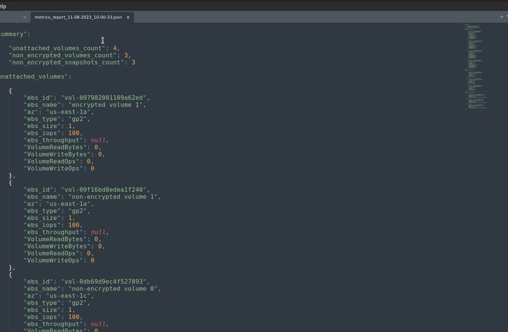

# UC#6

TODO:
1. Create EBS resources
2. Set up Lambda function
3. Create an S3 bucket
4. Confugure IAM
5. Schedule Lambda

As far as know, all modules we are going to use are included in AWS Lambda runtime, so I'm skipping requirements.txt file creation.

I've created user in AWS console to use aws cli for resource creation

## screenshot 1


Let's check how it can be done.
## screenshot 2


here is an example:
```
aws ec2 create-volume \
    --volume-type gp2 \
    --size 10 \
    --availability-zone us-east-1a \
    --profile <profile name>`
```

it is fullfil our requirements:
"Setup cloud infrastructure by creating 1 unattached disk, 2 non-encrypted disks, 3 non-encrypted snapshots."

<em>there is an error, region was not specified, but I missed to make a proper screenshot here, supposing it will fit in one screencast.</em>

let's try to apply it
I've specified a region in aws configure file
we can try again

ok volume was created

let's create 2 non encrypted disks
guess it's the same command but with some parameter to define unencrypted state.

```
aws ec2 create-volume \
    --volume-type gp2 \
    --size 10 \
    --availability-zone us-east-1a \
	--no-encrypted \
    --profile <profile name>
```
ok we did it twice

let's check the console if everything is fine so far
## screenshot 6


as we can see all 3 volumes are unencrypted
so as we have in reqs one volume separate, I suggest it should be encrypted

let's make it encrypted
`aws ec2 create-volume \
    --volume-type gp2 \
    --size 10 \
    --availability-zone us-east-1a \
	--encrypted \
    --profile <profile name>`

as we have one encrypted volume, one of the previously created can be deleted

'aws ec2 describe-volumes us-east-1 --profile <profile name>'

'aws ec2 delete-volume --volume-id vol-1234567890 --profile <profile name>'

Ok let's move on to snapshots:
'aws ec2 describe-volumes \
    --query "Volumes[].{ID:VolumeId}" \
    --profile <profile name>'

```
aws ec2 create-snapshot --volume-id vol-1234567890 --description "this volume is encrypted" --profile <profile name>
```

let's check console for snapshots
## screenshot 10



now let's create a lambdda function

## screenshot 11


```
aws lambda create-function \
    --function-name ResMetrics \
    --runtime python3.11 \
    --zip-file fileb://res-metrics.zip \
    --handler main.handler \
    --role arn:aws:iam::123456789012:role/service-role/MyTestFunction-role
```

 actually it's easier to do in console, if we are not going to automate this deployment

## screenshot 12


 we have added policy to be able describe our resources
 let's add policy to be abele to write output in s3 bucket
## screenshot 13


## screenshot 14


 but firstly we need to create s3 bucket itself, to have it arn

## screenshot 15


' aws s3api create-bucket \
    --bucket vol-metrics \
    --region us-east-1 \
    --profile <profile name>'

## screenshot 16


s3 bucket created
Lifecycle rule added

Pause at 07-08-2023_00:16

spent 1H
--------------------------------------
Start at 07-08-2023_09:45

let's add policy to be able to write output in s3 bucket
## screenshot 17


ok, now we are almost ready to start our lambda coding
let's quickly check if such lambda exist

## screenshot 18


from my previous experience I know that we have to access to volumes and snapshots via boto3 ec2 client

I have doubts that any of created volumes should be attached
but let's assume that we will need to filter out unattached volumes anyway

Pause at 07-08-2023_11:00

spent 1.25H
--------------------------------------
Start at 07-08-2023_16:30

I have found the following repo with similar functionality

ref:
https://github.com/ericg-aws/aws-storage-get-metrics/blob/main/get-ebs-metrics.py


let's modify it a bit for our needs

I've realized that I need add more permissions to get CloudWatch metrics

## screenshot 19


of course they can be united in one policy, but I like when they are granular
another thing I'd like to do is to make running code locally for faster dedugging

Pause at 07-08-2023_17:00

spent 0.5H
--------------------------------------
Start at 08-08-2023_00:30

let's define what metrics we are going to collect, to underestand that I'll check boto3 documentation for possible options:
https://boto3.amazonaws.com/v1/documentation/api/latest/reference/services/ec2/client/describe_volumes.html

https://hands-on.cloud/boto3-cloudwatch-tutorial/
https://stackoverflow.com/questions/37324085/boto3-get-ec2-instances-volume
https://gist.github.com/beaufour/1840415

Pause at 08-08-2023_01:30

spent 1.0H
-------------------------------------- 
Start at 09-08-2023_12:30

## screenshot 20


As I have had some experience collecting resource information through boto3,
I decided to collect the following metrics:

for volumes:
- 'ebs_id'
- 'ebs_name'
- 'ebs_device' <em>redundant</em>
- 'ec2_instance_id' <em>redundant</em>
- 'ec2_instance_name' <em>redundant</em>
- 'region' <em>redundant</em>
- 'az'
- 'ebs_type' 
- 'ebs_size'
- 'ebs_iops'
- 'ebs_throughput'

## screenshot 21


for snapshots:
- 'snapshot_id'
- 'snapshot_name'
- 'region'
- 'snapshot_size'
- 'snapshot_creation_date'

Pause at 09-08-2023_14:00

spent 1.5H
-------------------------------------- 
Start at 10-08-2023_09:30

additionaly as aws give us a possibility to collect more metrics with CloudWath, I'll try to get more info about volume activity as the following valuable metrics:
- Volume Read/Write Bytes
- Volume Read/Write Ops

this metrics can show us if volume had recent activity, so we can understand if it was attached recently (within 1 day eriod for example)

After several tests, I realized that the list of metrics can be shortened to get rid of redundant information:
for volumes:
- 'ebs_id'
- 'ebs_name'
- 'az'
- 'ebs_type'
- 'ebs_size'
- 'ebs_iops'
- 'ebs_throughput' #valid only for gp3

for snapshots no changes

As we don't have CI/CD setup, I've created a version to test it locally, by using configured aws profile
there will be a difference in main function to call all other service functions and put metrics report in s3 bucket.

```
def main():
    total_report = generate_consolidated_report()

    bucket_name = "vol-metrics"
    current_datetime = datetime.now().strftime('%d-%m-%Y_%H-%M-%S')
    filename = f"metrics_report_{current_datetime}.json"

    save_to_s3(total_report, filename, bucket_name)


if __name__ == "__main__":
    main()
```

in lambda will be called by handler function:
```
def lambda_handler(event, context):

    total_report = generate_consolidated_report()
    bucket_name = "vol-metrics"
    current_datetime = datetime.now().strftime('%d-%m-%Y_%H-%M-%S')
    filename = f"metrics_report_{current_datetime}.json"
    save_to_s3(total_report, filename, bucket_name)

    return {
        'statusCode': 200,
        'body': json.dumps('Report generated successfully!')
    }
```


## screenshot 22


Pause at 10-08-2023_11:00

spent 1.5H
-------------------------------------- 
Start at 11-08-2023_12:00

let's add EventBridge rule to trigger our function once a day
## screenshot 23

`aws events put-rule --schedule-expression "rate(1 day)" --name everyDayRule --profile gen-ai`


let's test our lambda
## screenshot 24


Metrics report generated successfully
## screenshot 25


SPENT TOTAL 8H
-------------------------------------- 