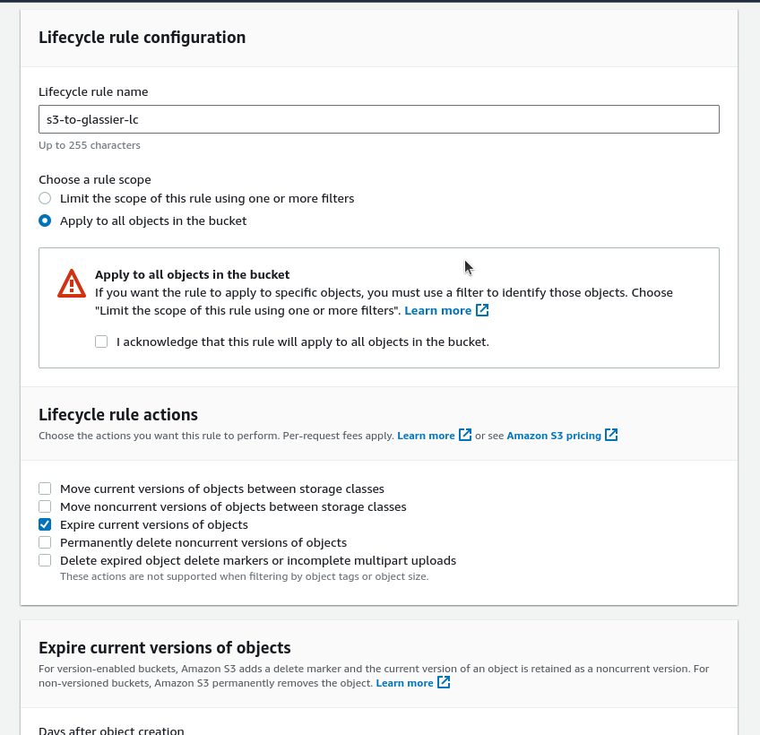

# UC#6

TODO:
1. Create EBS resources
2. Set up Lambda function
3. Create an S3 bucket
4. Confugure IAM
5. Schedule Lambda

As far as know, all modules we are going to use are included in AWS Lambda runtime, so I'm skipping requirements.txt file creation.

I've created user in AWS console to use aws cli for resource creation

## screenshot 1

Let's check how it can be done.
## screenshot 2

here is an example:
`aws ec2 create-volume \
    --volume-type gp2 \
    --size 10 \
    --availability-zone us-east-1a \
    --profile gen-ai`

it is fullfil our requirements:
"Setup cloud infrastructure by creating 1 unattached disk, 2 non-encrypted disks, 3 non-encrypted snapshots."
## screenshot 3

let's try to apply it
I've specified a region in aws configure file
we can try again

ok volume was created
## screenshot 4

let's create 2 non encrypted disks
guess it's the same command but with some parameter to define unencrypted state.

`
aws ec2 create-volume \
    --volume-type gp2 \
    --size 10 \
    --availability-zone us-east-1a \
	--no-encrypted \
    --profile gen-ai
`
ok we did it twice
## screenshot 5

let's check the console if everything is fine so far
## screenshot 6

as we can see all 3 volumes are unencrypted
so as we have in reqs one volume separate, I suggest it should be encrypted

## screenshot 7

let's make it encrypted
`aws ec2 create-volume \
    --volume-type gp2 \
    --size 10 \
    --availability-zone us-east-1a \
	--encrypted \
    --profile gen-ai`

as we have one encrypted volume, one of the previously created can be deleted

'aws ec2 describe-volumes us-east-1 --profile gen-ai'

'aws ec2 delete-volume --volume-id vol-049df61146c4d7901 --profile gen-ai'

Ok let's move on to snapshots:
'aws ec2 describe-volumes \
    --query "Volumes[].{ID:VolumeId}" \
    --profile gen-ai'

## screenshot 8

vol-0a0a6e1e3e7f48bc7
vol-0676374e43097a4a7
vol-011597d53fcdc9581

aws ec2 create-snapshot --volume-id vol-011597d53fcdc9581 --description "this volume is encrypted" --profile gen-ai
## screenshot 9

let's check console for snapshots
## screenshot 10

now let's create a lambdda function

## screenshot 11

aws lambda create-function \
    --function-name ResMetrics \
    --runtime python3.11 \
    --zip-file fileb://res-metrics.zip \
    --handler main.handler \
    --role arn:aws:iam::123456789012:role/service-role/MyTestFunction-role-tges6bf4

 actually it's easier to do in console, if we are not going to automate this deployment

## screenshot 12

 we have added policy to be able describe our resources
 let's add policy to be abele to write output in s3 bucket
## screenshot 13

## screenshot 14

 but firstly we need to create s3 bucket itself, to have it arn

## screenshot 15

' aws s3api create-bucket \
    --bucket vol-metrics \
    --region us-east-1 \
    --profile gen-ai'

## screenshot 16

s3 bucket created
Lifecycle rule added

Pause at 07-08-2023_00:16 
--------------------------------------

let's add policy to be abele to write output in s3 bucket